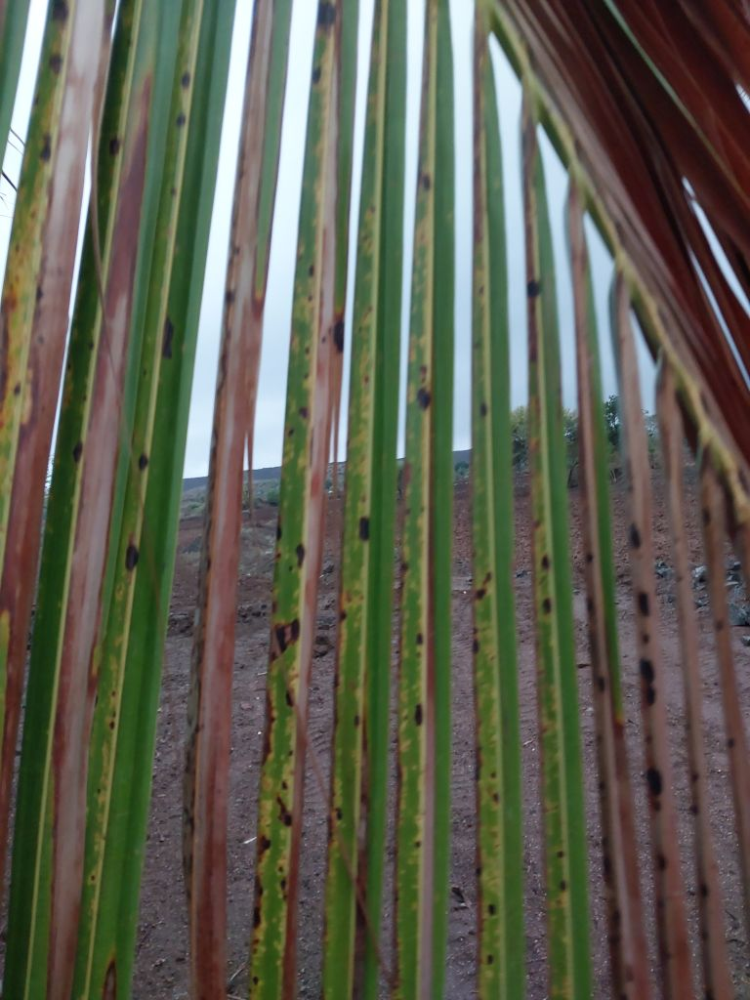

# Coconut Tree Disease Classification Dataset

[](https://creativecommons.org/licenses/by/4.0/)
[](#changelog)

A dataset of coconut tree images for disease classification, collected and organized for computer vision and deep learning research in agricultural applications.

- Project page: ``

## TL;DR

- **Task**: classification (five classes: `bud_root_dropping`, `bud_rot`, `gray_leaf_spot`, `leaf_rot`, `stem_bleeding`)
- **Modality**: RGB
- **Platform**: handheld/field
- **Real/Synthetic**: real
- **Images**: 5,798 labeled images
- **Classes**: 5 disease categories
- **Resolution**: various (typically 768×1024 or similar)
- **Annotations**: COCO JSON (image-level via full-image boxes)
- **License**: CC BY 4.0 (see LICENSE)
- **Citation**: see below

## Table of contents

- [Download](#download)
- [Dataset structure](#dataset-structure)
- [Sample images](#sample-images)
- [Annotation schema](#annotation-schema)
- [Stats and splits](#stats-and-splits)
- [Quick start](#quick-start)
- [Evaluation and baselines](#evaluation-and-baselines)
- [Datasheet (data card)](#datasheet-data-card)
- [Known issues and caveats](#known-issues-and-caveats)
- [License](#license)
- [Citation](#citation)
- [Changelog](#changelog)
- [Contact](#contact)

## Download

- Original dataset: ``
- This repo hosts structure and conversion scripts only; place the downloaded folders under this directory.
- Local license file: see `LICENSE` (CC BY 4.0).

## Dataset structure

This dataset follows the standardized dataset structure specification with subcategory organization:

```
coconut_tree_disease_classification/
├── coconut_trees/              # Main category directory
│   ├── bud_root_dropping/     # Bud root dropping disease
│   │   ├── csv/                # CSV annotations per image
│   │   ├── json/               # JSON annotations per image
│   │   └── images/             # Bud root dropping images
│   ├── bud_rot/                # Bud rot disease
│   │   ├── csv/
│   │   ├── json/
│   │   └── images/
│   ├── gray_leaf_spot/         # Gray leaf spot disease
│   │   ├── csv/
│   │   ├── json/
│   │   └── images/
│   ├── leaf_rot/               # Leaf rot disease
│   │   ├── csv/
│   │   ├── json/
│   │   └── images/
│   ├── stem_bleeding/          # Stem bleeding disease
│   │   ├── csv/
│   │   ├── json/
│   │   └── images/
│   ├── labelmap.json           # Label mapping (bud_root_dropping=1, bud_rot=2, gray_leaf_spot=3, leaf_rot=4, stem_bleeding=5)
│   └── sets/                   # Dataset splits
│       ├── train.txt
│       ├── val.txt
│       ├── test.txt
│       ├── all.txt
│       └── train_val.txt
├── annotations/                # COCO format JSON (generated)
│   ├── coconut_trees_instances_train.json
│   ├── coconut_trees_instances_val.json
│   └── coconut_trees_instances_test.json
├── scripts/
│   └── convert_to_coco.py     # COCO conversion script
├── LICENSE
├── README.md
└── requirements.txt
```

- Splits: `coconut_trees/sets/train.txt`, `coconut_trees/sets/val.txt`, `coconut_trees/sets/test.txt` (and also `all.txt`, `train_val.txt`) list image basenames (no extension). If missing, all images are used.

## Sample images

Below are example images for each category in this dataset. Paths are relative to this README location.

<table>
  <tr>
    <th>Category</th>
    <th>Sample</th>
  </tr>
  <tr>
    <td><strong>Bud Root Dropping</strong></td>
    <td>
      
      <div align="center"><code>coconut_trees/bud_root_dropping/images/BudRootDropping001.jpg</code></div>
    </td>
  </tr>
  <tr>
    <td><strong>Bud Rot</strong></td>
    <td>
      
      <div align="center"><code>coconut_trees/bud_rot/images/BudRot001.jpg</code></div>
    </td>
  </tr>
  <tr>
    <td><strong>Gray Leaf Spot</strong></td>
    <td>
      
      <div align="center"><code>coconut_trees/gray_leaf_spot/images/GrayLeafSpot001.jpg</code></div>
    </td>
  </tr>
  <tr>
    <td><strong>Leaf Rot</strong></td>
    <td>
      
      <div align="center"><code>coconut_trees/leaf_rot/images/LeafRot001.jpg</code></div>
    </td>
  </tr>
  <tr>
    <td><strong>Stem Bleeding</strong></td>
    <td>
      
      <div align="center"><code>coconut_trees/stem_bleeding/images/StemBleeding001.jpg</code></div>
    </td>
  </tr>
</table>

## Annotation schema

- **CSV per-image schemas** (stored under each subcategory's `csv/` folder):
  - Classification task: columns include `#item, x, y, width, height, label` (full-image bounding box: `[0, 0, image_width, image_height]`).
  
- **COCO-style** (generated):
```json
{
  "info": {
    "year": 2025,
    "version": "1.0.0",
    "description": "Coconut Tree Disease Classification coconut_trees train split",
    "url": ""
  },
  "images": [
    {
      "id": 1,
      "file_name": "coconut_trees/bud_root_dropping/images/BudRootDropping001.jpg",
      "width": 768,
      "height": 1024
    }
  ],
  "categories": [
    {"id": 1, "name": "bud_root_dropping", "supercategory": "coconut_tree"},
    {"id": 2, "name": "bud_rot", "supercategory": "coconut_tree"},
    {"id": 3, "name": "gray_leaf_spot", "supercategory": "coconut_tree"},
    {"id": 4, "name": "leaf_rot", "supercategory": "coconut_tree"},
    {"id": 5, "name": "stem_bleeding", "supercategory": "coconut_tree"}
  ],
  "annotations": [
    {
      "id": 1,
      "image_id": 1,
      "category_id": 1,
      "bbox": [0, 0, 768, 1024],
      "area": 786432,
      "iscrowd": 0
    }
  ]
}
```

- **Label maps**: `coconut_trees/labelmap.json` defines the category mapping; the provided converter normalizes to 5 categories (bud_root_dropping=1, bud_rot=2, gray_leaf_spot=3, leaf_rot=4, stem_bleeding=5).

## Stats and splits

- **Total labeled images**: 5,798
  - Bud Root Dropping: 514 images
  - Bud Rot: 470 images
  - Gray Leaf Spot: 2,135 images
  - Leaf Rot: 1,673 images
  - Stem Bleeding: 1,006 images
- **Training set**: 4,058 images (4,058 annotations) (`coconut_trees/sets/train.txt`)
- **Validation set**: 869 images (869 annotations) (`coconut_trees/sets/val.txt`)
- **Test set**: 871 images (871 annotations) (`coconut_trees/sets/test.txt`)

Splits provided via `coconut_trees/sets/*.txt`. You may define your own splits by editing those files.

## Quick start

### Using COCO API

```python
from pycocotools.coco import COCO
import json

# Load COCO annotations
coco = COCO('annotations/coconut_trees_instances_train.json')

# Get all image IDs
img_ids = coco.getImgIds()

# Get annotations for first image
ann_ids = coco.getAnnIds(imgIds=img_ids[0])
anns = coco.loadAnns(ann_ids)

# Load image info
img_info = coco.loadImgs(img_ids[0])[0]
print(f"Image: {img_info['file_name']}")
print(f"Size: {img_info['width']}x{img_info['height']}")
```

### Converting to COCO format

If you need to regenerate COCO annotations from CSV files:

```bash
python scripts/convert_to_coco.py --root . --out annotations \
    --category coconut_trees --splits train val test
```

### Dependencies

Required:
- `Pillow>=9.5` (for image processing)

Optional:
- `pycocotools>=2.0.7` (for COCO API)

Install with:
```bash
pip install -r requirements.txt
```

## Evaluation and baselines

- **Primary metric**: Classification accuracy
- **Baseline results**: (to be added)

## Datasheet (data card)

### Motivation

This dataset was created to support research in automated coconut tree disease detection and classification, which is crucial for agricultural productivity and food security in coconut-growing regions.

### Composition

The dataset consists of:
- **Image types**: RGB images of coconut trees showing various disease conditions
- **Categories**: 5 disease classes (bud_root_dropping, bud_rot, gray_leaf_spot, leaf_rot, stem_bleeding)
- **Annotation format**: Full-image bounding boxes for classification tasks

### Collection process

- **Source**: Images collected from various sources for coconut tree disease research
- **Annotation tool**: Custom script generating COCO format annotations
- **Validation**: Manual validation of images and annotations

### Preprocessing

- Images are organized by disease category
- Each image has a corresponding CSV and JSON annotation file
- Full-image bounding boxes are used for classification tasks

### Distribution

- Dataset is distributed under CC BY 4.0 license
- Structure follows standardized dataset organization specification

### Maintenance

- Dataset structure has been standardized according to the dataset structure specification
- COCO format annotations are generated from CSV files using the provided conversion script

## Known issues and caveats

- **Coordinate system**: Bounding boxes use `[x, y, width, height]` format (top-left corner + dimensions)
- **File naming**: Image files use consistent naming patterns (e.g., `BudRootDropping001.jpg`, `StemBleeding001.jpg`)
- **Image format**: All images are in JPEG format
- **Annotation format**: For classification tasks, full-image bounding boxes are used (covering the entire image)
- **Category IDs**: Category IDs start from 1 (bud_root_dropping=1, bud_rot=2, gray_leaf_spot=3, leaf_rot=4, stem_bleeding=5)

## License

This dataset is licensed under the Creative Commons Attribution 4.0 International License (CC BY 4.0).

Check the original dataset terms and cite appropriately.

See `LICENSE` file for full license text.

## Citation

If you use this dataset, please cite:

```bibtex
@dataset{coconut_tree_disease_classification_2025,
  title={Coconut Tree Disease Classification Dataset},
  author={Dataset Contributors},
  year={2025},
  license={CC BY 4.0},
  url={}
}
```

## Changelog

- **V1.0.0** (2025): Initial standardized structure and COCO conversion utility

## Contact

- **Maintainers**: (to be added)
- **Original authors**: (to be added)
- **Source**: ``
